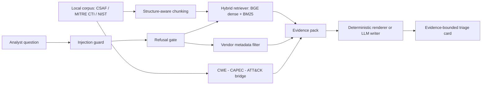

# LineGuard — Evidence-Bounded Triage for Industrial Cybersecurity

LineGuard is a Retrieval-Augmented Generation (RAG) question-answering assistant for a junior OT/ICS security analyst at a manufacturing company. It answers natural-language questions over a corpus of NIST standards, CISA ICS advisories (CSAF), MITRE ATT&CK for ICS, and MITRE CAPEC, and renders each answer as an **evidence-bounded triage card** in which every claim carries an explicit evidence label: `HARD-CITED`, `RETRIEVAL-SUGGESTED`, or `NO EVIDENCE`. When a question cannot be answered from the corpus, the assistant refuses honestly rather than guessing.

---

## Why this design

A hallucinated security recommendation is worse than no recommendation. LineGuard is built so the language model **cannot introduce facts**:

- **Hard-cited evidence** is assembled deterministically from CISA advisory fields, a CVSS-vector parser, and a `CWE -> CAPEC -> ATT&CK` resolver computed from MITRE's structured data — never from free text.
- **Retrieval-suggested evidence** (NIST and ATT&CK passages) is labelled and marked *analyst-confirmation-required*.
- **Generation** (when enabled) only rewrites the already-assembled evidence pack under a strict system prompt; if the backend is off or unavailable, a deterministic template renders the same evidence. Refusals never call the model.

---

## Pipeline



**Tier coverage (per the brief):**

- **Tier 1** — end-to-end RAG (ingest -> chunk -> embed -> FAISS -> retrieve -> answer with citations), handles all Section 2 example questions including the honesty test. Optional LLM answer generation (Section 17 of the notebook).
- **Tier 2** — hybrid dense+BM25 retrieval, structure-aware chunking, query decomposition, **vendor/severity metadata filtering**, and a 26-question evaluation harness with an ablation.
- **Tier 3** — deterministic `CWE -> CAPEC -> ATT&CK` taxonomy bridge, a working prompt-injection red-team with an implemented guardrail, and an optional local open-weights writer.

---

## Repository structure

```
.
├── LineGuard_Evidence_Bounded_Triage_CSAF.ipynb    # the runnable Colab notebook (sections 1–21)
├── README.md                                       # this file
├── LINEGUARD_DATASET/                              # corpus (see "Dataset setup"); not committed if large
│   ├── csaf_files/                                 # cisagov/CSAF advisory JSON tree
│   ├── cti-master/                                 # mitre/cti clone (CAPEC + ATT&CK for ICS)
│   └── nist/                                       # the two NIST PDFs
└── outputs/                                        # produced by a Run-all
    ├── corpus_manifest.json                        # SHA-256 of every framework file + selected advisory
    ├── eval_results.json, ablation.json
    ├── eval_comparison.png, eda_corpus.png
    ├── retrieval_results.csv
    └── demo_cards/demo_1.md … demo_6.md
```

---

## Dataset setup

LineGuard is **local-first and corpus-reproducible**: CISA advisories are loaded only from local CSAF JSON (no live CISA scraping), and MITRE and NIST load from disk with the public URLs as a fallback only. Download the four public sources below and place them under a single `LINEGUARD_DATASET/` root.

| Source | Download | Place under |
| --- | --- | --- |
| CISA ICS advisories (CSAF 2.0 JSON) | https://github.com/cisagov/CSAF | `LINEGUARD_DATASET/csaf_files/` |
| MITRE CTI (CAPEC + ATT&CK for ICS) | https://github.com/mitre/cti | `LINEGUARD_DATASET/cti-master/` |
| NIST SP 800-82 Rev. 3 | https://nvlpubs.nist.gov/nistpubs/SpecialPublications/NIST.SP.800-82r3.pdf | `LINEGUARD_DATASET/nist/NIST.SP.800-82r3.pdf` |
| NIST CSF 2.0 (CSWP 29) | https://nvlpubs.nist.gov/nistpubs/CSWP/NIST.CSWP.29.pdf | `LINEGUARD_DATASET/nist/NIST.CSWP.29.pdf` |

Expected layout:

```
LINEGUARD_DATASET/
├── csaf_files/                 # the loader searches recursively (rglob) and keeps icsa-*/icsma-*.json
│   └── OT/white/<year>/…
├── cti-master/
│   ├── capec/2.1/stix-capec.json
│   └── ics-attack/ics-attack.json
└── nist/
    ├── NIST.SP.800-82r3.pdf
    └── NIST.CSWP.29.pdf
```

The notebook resolves the dataset root in this order, so it runs from a cloned repo or from Google Drive without code edits:

```
./LINEGUARD_DATASET   ->   ./data/LINEGUARD_DATASET   ->   /content/drive/MyDrive/LINEGUARD_DATASET
```

Override any location with the environment variables below.

---

## How to run (Google Colab, free T4)

1. Open `LineGuard_Evidence_Bounded_Triage_CSAF.ipynb` in Google Colab and select a GPU runtime (T4 is sufficient).
2. Put `LINEGUARD_DATASET/` on Google Drive (or in the repo working directory). The first cell mounts Drive.
3. `Runtime -> Run all`.

A correct run prints, in order:

```
mode=submission | min_cisa=50 | max_cisa=175 | backend=none
[smoke] CSAF advisories discovered: <N> (submission floor=50) -> OK
[corpus] CSAF JSON: loaded 175 advisories from 175 candidate file(s)
[corpus] advisory family mix: {'icsa': 175}
[corpus] CAPEC, ATT&CK-ICS, NIST SP 800-82, NIST CSF 2.0 ready
```

**Modes.** `submission` (default) loads the full advisory cap; `demo` (`LINEGUARD_MODE=demo`) loads only a few advisories for fast iteration.

**Answer generation.** The default reproducible run uses the deterministic evidence-bounded renderer (`LLM_BACKEND=none`), which cannot introduce unsupported claims. Section 17 demonstrates the Tier-1 LLM writer over the same evidence pack (a local open-weights model); set `LLM_BACKEND=hf_local` (or `groq` with an API key) to produce fluent prose answers.

---

## Configuration

| Variable | Default | Purpose |
| --- | --- | --- |
| `LINEGUARD_MODE` | `submission` | `submission` (full corpus) or `demo` (a few advisories) |
| `LINEGUARD_DATASET_ROOT` | (auto) | Override the dataset root resolution |
| `CSAF_DIRS` | `<root>/csaf_files` | CSAF advisory search root (recursive) |
| `CTI_ROOT` | `<root>/cti-master` | Local MITRE CTI clone (CAPEC + ATT&CK-ICS) |
| `NIST_ROOT` | `<root>/nist` | Local NIST PDFs |
| `MIN_CISA_ADVISORIES` | `50` | Submission floor; the loader fails loudly below it |
| `MAX_CISA_ADVISORIES` | `175` | Cap on advisories loaded (manufacturing `icsa-` first) |
| `LLM_BACKEND` | `none` | `none` (deterministic), `hf_local`, or `groq` |
| `LLM_MODEL` | `Qwen/Qwen2.5-3B-Instruct` | Local writer model (Section 17 demo uses the 1.5B variant) |
| `GROQ_API_KEY` / `GROQ_MODEL` | — | Hosted backend (optional) |
| `CARD_MODE` | `full` | `full` triage card or `compact` card |
| `VENDOR_MATCH_LIMIT` | `8` | Advisories listed by the vendor metadata filter |

---

## Components

- **Corpus loader** — local-first CSAF / MITRE / NIST resolution; recursive CSAF discovery filtered to `icsa-`/`icsma-`, with manufacturing `icsa-` prioritised for the brief; excludes `.asc`/`.sha512` sidecars; enforces the advisory floor.
- **Structure-aware chunking** — separate strategies for NIST PDFs (section-aware), CISA advisories, and ATT&CK-ICS techniques.
- **Hybrid retriever** — dense `BAAI/bge-small-en-v1.5` fused with BM25, with deterministic query decomposition and metadata filtering.
- **CWE -> CAPEC -> ATT&CK bridge** — deterministic resolver over MITRE CAPEC and ATT&CK for ICS; states plainly when no hard mapping exists rather than guessing.
- **Safety** — an `InjectionGuard` (rule tier plus a `protectai/deberta-v3-base-prompt-injection-v2` classifier) screens the query before retrieval and quarantines suspicious retrieved chunks; a `RefusalGate` enforces honest "not in the corpus" answers.
- **Vendor metadata filter** — vendor-scoped questions (e.g. "summarise advisories affecting Siemens") are answered deterministically from advisory fields and labelled `HARD-CITED`.

---

## Example questions

All five are demonstrated in the notebook (Section 16), with `ask()` as the single entry point:

1. *What does NIST recommend regarding remote access to OT networks?* — grounded NIST SP 800-82 guidance with page citations.
2. *Summarise recent advisories affecting Siemens industrial products.* — deterministic vendor metadata filter listing real `icsa-` advisories (ID, product, CWEs, severity, CVSS, link), `HARD-CITED`.
3. *What is the difference between IT security and OT security priorities?* — conceptual answer grounded in retrieved guidance.
4. *Which ATT&CK for ICS techniques involve manipulation of control logic?* — ATT&CK-ICS candidate techniques, `RETRIEVAL-SUGGESTED`.
5. *(Honesty test) What is our company's firewall configuration?* — refused as outside the public corpus, with an analyst checklist of what to inspect internally.

---

## Evaluation

Reproduced by a full Run-all (Section 14). Corpus: **175 CISA advisories, 82 vendors, 804 CVEs, 1,161 chunks**; severity mix High 74 / Critical 68 / Medium 31 / Low 2.

| Metric | Baseline | Improved |
| --- | --- | --- |
| Retrieval Hit@5 | 0.950 | 0.850 |
| Retrieval MRR | 0.770 | 0.812 |
| Metadata-filtered Hit@5 | — | **0.950** |
| Metadata-filtered MRR | — | **0.887** |
| Refusal accuracy | 0.500 | **1.000** |
| Hard-edge precision | 0.750 | **1.000** |
| Hard-map recall | — | **1.000** |
| Injection attack success rate (lower better) | 1.000 | **0.000** |
| Injection false-positive rate | — | 0.000 |
| Citation coverage | — | 1.000 |

**Honest reading.** Dense retrieval is already strong on this corpus, so adding BM25 did not improve Hit@5 (it slightly regressed within the noise of a 20-question set). The deployed configuration is therefore **dense + metadata filtering** (headline Hit@5 0.950 / MRR 0.887); full hybrid is reported as an ablation. The clear, defensible gains are in honest refusals, hard-edge precision, hard-map recall, and prompt-injection resistance — the dimensions that matter most for safe deployment.

---

## AI Security Reflection

Full version in notebook Section 19. Three attack surfaces, each tied to an implemented control:

1. **Direct prompt injection in the query** — screened by `InjectionGuard` before retrieval; the query is refused on a strong hit.
2. **Indirect injection via the corpus** — generation is evidence-bounded; load-bearing claims are deterministic hard-cited fields and the structured `CWE -> CAPEC -> ATT&CK` chain, so injected prose cannot fabricate a mapping. Suspicious retrieved chunks are quarantined.
3. **Corpus integrity / supply chain** — the corpus manifest records a SHA-256 for every framework file and every selected advisory; the loader excludes unsigned sidecars and enforces a minimum advisory floor.

**Consequence if unmitigated:** mis-triage of a real OT vulnerability, misplaced trust in a hallucinated mapping, or leakage/manipulation of system behaviour.

---

## Limitations

- `CWE -> CAPEC -> ATT&CK` hard coverage is 44.3% of CAPEC-known CWEs; out-of-coverage CWEs are reported as "no hard mapping supported" rather than guessed.
- The advisory corpus is capped (175 by default, newest manufacturing `icsa-` first); medical `icsma-` advisories are retained only as overflow to match the manufacturing brief.
- The evaluation set is small (20 retrieval + 6 refusal questions); metrics indicate direction, not population-level precision.
- LLM-writer answers depend on the chosen open model; the deterministic renderer is the reproducible default.

---

## AI usage statement

AI coding assistants were used for debugging support, refactoring suggestions, documentation wording, and test-case brainstorming. The author engineered, reviewed, adapted, and validated all code, the system architecture, the evaluation design, and the final outputs, and is prepared to explain every implementation and design decision during the panel Q&A.

---

## Corpus attribution and licensing

Built only from public, openly licensed OT/ICS security sources:

- NIST SP 800-82 Rev. 3 — Guide to OT Security (US Government, public domain)
- NIST Cybersecurity Framework 2.0 / CSWP 29 (US Government, public domain)
- CISA ICS Advisories, consumed as official CSAF 2.0 JSON (US Government, public domain)
- MITRE ATT&CK for ICS — © MITRE, used with attribution
- MITRE CAPEC — © MITRE, used with attribution

No paywalled or restricted content is included.

