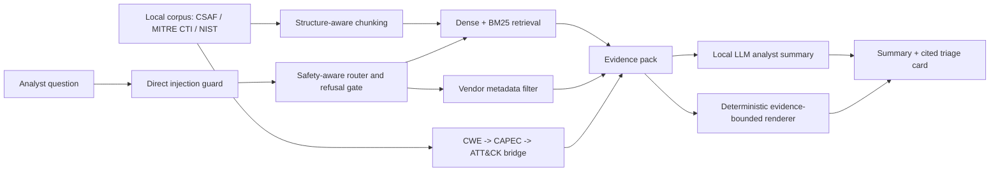

# LineGuard — Evidence-Bounded Triage for OT/ICS Cybersecurity

LineGuard is a retrieval-augmented assistant for a junior operational technology / industrial control systems (OT/ICS) security analyst. It answers natural-language questions over public OT/ICS security sources — NIST SP 800-82 Rev. 3, NIST Cybersecurity Framework 2.0, CISA ICS advisories in CSAF JSON, MITRE ATT&CK for ICS, and MITRE CAPEC — and renders each response as an **evidence-bounded triage card**.

Every substantive evidence claim in the card is labelled as one of:

| Evidence label | Meaning |
| --- | --- |
| `HARD-CITED` | Deterministic advisory fields, CVSS-derived properties, or the structured MITRE `CWE -> CAPEC -> ATT&CK` chain. |
| `RETRIEVAL-SUGGESTED` | Relevant NIST / ATT&CK-for-ICS guidance found by retrieval; analyst confirmation required. |
| `NO EVIDENCE` | The public corpus does not support the claim, so LineGuard states the limit instead of guessing. |

The key design principle is simple: **the LLM improves readability, but the cited triage card remains deterministic and evidence-bounded**.

---

## Why This Design

A hallucinated security recommendation can be worse than no recommendation. LineGuard is therefore built around strict evidence boundaries:

- **Hard-cited evidence** is assembled deterministically from CISA advisory fields, CVSS vectors, and MITRE structured data.
- **Retrieval-suggested guidance** is labelled separately and marked as analyst-confirmation-required.
- **The local LLM writer** receives only the retrieved, labelled evidence pack and writes a short analyst summary above the deterministic card.
- **The deterministic card** preserves source lines, evidence labels, refusal boundaries, and hard/no-hard mapping decisions.
- **Refusals** are produced without relying on the model when the user asks for internal company data or prompt-injection behaviour.

These boundaries are not just asserted — the appended rigorous test suite (see **Robustness and Stress Testing**) cross-checks every `HARD-CITED` ATT&CK technique in a rendered card against the structured bridge output, so a fabricated mapping cannot pass silently (0 / 120 fabricated in the submitted run).

---

## System Architecture



---

## Tier Coverage

- **Tier 1 — RAG with cited answers.** The notebook ingests local OT/ICS sources, chunks them, embeds them with `BAAI/bge-small-en-v1.5`, retrieves relevant evidence, and answers all brief example questions with source citations. Section 16 demonstrates the local LLM analyst-summary mode over the same deterministic evidence pack.
- **Tier 2 — improved retrieval and evaluation.** The notebook includes structure-aware chunking, dense + BM25 retrieval, query decomposition, vendor metadata filtering, reranker ablation, corpus EDA, and a retrieval/refusal/hard-edge evaluation harness.
- **Tier 3 — security controls and agentic routing.** The notebook implements a safety-aware router, direct prompt-injection refusal, indirect-injection quarantine for poisoned retrieved chunks, internal-data refusal, and a deterministic `CWE -> CAPEC -> ATT&CK` bridge.

---

## Repository Structure

```text
.
├── LineGuard_SecureOps_Assistant.ipynb             # runnable Colab notebook, sections 1-17 + rigorous test cells
├── README.md                                       # this file
├── LINEGUARD/                                       # local corpus root; not committed
│   ├── csaf_files/                                  # cisagov/CSAF clone, searched recursively
│   ├── cti-master/                                  # mitre/cti clone: CAPEC + ATT&CK for ICS
│   └── nist/                                        # NIST PDFs
└── outputs/                                         # produced by Run all
    ├── ablation.json
    ├── corpus_manifest.json
    ├── eval_results.json
    ├── eval_comparison.png
    ├── eda_corpus.png
    ├── retrieval_results.csv
    ├── rigorous_retrieval.json                      # per-item robustness results (bootstrap CIs)
    └── demo_cards/
        ├── demo_1.md ... demo_6.md
        └── agentic_1.md ... agentic_5.md
```

---

## Dataset Setup

LineGuard is **local-first and corpus-reproducible**. CISA advisories are loaded from local CSAF JSON files; the notebook does not scrape live CISA webpages during submission mode. MITRE and NIST are expected to load from local files in the submitted run; public URLs are present only as fallback paths if local files are missing.

Download the public sources below and place them under one `LINEGUARD/` root.

| Source | Download | Place under |
| --- | --- | --- |
| CISA ICS advisories, CSAF 2.0 JSON | https://github.com/cisagov/CSAF | `LINEGUARD/csaf_files/` |
| MITRE CTI: CAPEC + ATT&CK for ICS | https://github.com/mitre/cti | `LINEGUARD/cti-master/` |
| NIST SP 800-82 Rev. 3 | https://nvlpubs.nist.gov/nistpubs/SpecialPublications/NIST.SP.800-82r3.pdf | `LINEGUARD/nist/NIST.SP.800-82r3.pdf` |
| NIST Cybersecurity Framework 2.0 / CSWP 29 | https://nvlpubs.nist.gov/nistpubs/CSWP/NIST.CSWP.29.pdf | `LINEGUARD/nist/NIST.CSWP.29.pdf` |

Expected layout:

```text
LINEGUARD/
├── csaf_files/                 # recursively searched; keeps icsa-*.json and icsma-*.json
│   └── ...
├── cti-master/
│   ├── capec/2.1/stix-capec.json
│   └── ics-attack/ics-attack.json
└── nist/
    ├── NIST.SP.800-82r3.pdf
    └── NIST.CSWP.29.pdf
```

The notebook resolves the dataset root in this order:

```text
LINEGUARD_DATASET_ROOT -> ./LINEGUARD -> ./data/LINEGUARD -> /content/drive/MyDrive/LINEGUARD
```

Use `LINEGUARD_DATASET_ROOT`, `CSAF_DIRS` / `CSAF_JSON_DIRS`, `CTI_ROOT`, or `NIST_ROOT` if your paths differ.

> **Reproducibility note.** `cisagov/CSAF` grows over time, so the number of advisories discovered on disk increases with each re-clone. The submitted run indexes a fixed snapshot of **3,785** OT/ICS advisories. To keep a citable, fixed corpus, either keep `MAX_CISA_ADVISORIES` at the snapshot count or pin the clone to a specific commit and record it. The corpus manifest written to `outputs/corpus_manifest.json` captures the exact advisory count and per-file SHA-256 for the submitted run.

---

## How to Run in Google Colab

1. Open `LineGuard_SecureOps_Assistant.ipynb` in Google Colab.
2. Choose **Runtime -> Change runtime type -> T4 GPU**.
3. Place the corpus files under `MyDrive/LINEGUARD/` using the layout above, or set the environment variables to your local paths.
4. Run **Runtime -> Run all**.

A successful run begins with output similar to:

```text
mode=submission | fast_demo=0 | min_cisa=50 | max_cisa=3785 | card_mode=full | backend=hf_local (Qwen/Qwen2.5-1.5B-Instruct)
Pipeline components ready: True
[smoke] CSAF advisories discovered: 3785 (submission floor=50) -> OK
[corpus] CSAF JSON: loaded 3785 advisories from 3785 candidate file(s)
[corpus] CAPEC, ATT&CK-ICS, NIST SP 800-82, NIST CSF 2.0 ready; 3785 advisories loaded
```

**Modes.** `submission` is the default and indexes the most recent local OT/ICS CSAF advisories, capped by `MAX_CISA_ADVISORIES=3785` (the full staged snapshot in the submitted run; set `MAX_CISA_ADVISORIES=0` to index every staged advisory with no cap, or a smaller value for a faster, lighter run). `demo` mode (`LINEGUARD_MODE=demo`) loads only a few advisories and limits NIST pages for fast development.

**LLM behaviour.** The default final notebook uses `LLM_BACKEND=hf_local` and `LLM_MODEL=Qwen/Qwen2.5-1.5B-Instruct`. The LLM writes only a short analyst summary above the deterministic, fully cited card. If the local model is unavailable or unsafe output is detected, LineGuard falls back to the deterministic evidence-bounded renderer. Set `LLM_BACKEND=none` to force deterministic rendering only.

---

## Configuration

| Variable | Default | Purpose |
| --- | --- | --- |
| `LINEGUARD_MODE` | `submission` | `submission` for the capped full run, `demo` for fast development. |
| `LINEGUARD_DATASET_ROOT` | auto | Override dataset-root resolution. |
| `CSAF_DIRS` / `CSAF_JSON_DIRS` | `<root>/csaf_files` | Recursive CSAF advisory search roots. |
| `CTI_ROOT` | `<root>/cti-master` | Local MITRE CTI clone. |
| `NIST_ROOT` | `<root>/nist` | Local NIST PDF folder. |
| `MIN_CISA_ADVISORIES` | `50` | Submission floor; the loader fails loudly below it unless explicitly allowed. |
| `MAX_CISA_ADVISORIES` | `3785` | Advisory cap; submitted run indexes the full staged snapshot (`0` = no cap). |
| `EMBEDDING_MODEL` | `BAAI/bge-small-en-v1.5` | Dense retrieval model. |
| `DENSE_WEIGHT` | `0.5` | Dense/BM25 fusion weight for the hybrid retriever. |
| `USE_RERANKER` | `0` | Main pipeline reranker toggle. |
| `RUN_RERANKER_ABLATION` | `1` | Runs the Section 13B cross-encoder reranker comparison. |
| `RERANKER_MODEL` | `cross-encoder/ms-marco-MiniLM-L-6-v2` | Optional reranker used in ablation or if enabled. |
| `USE_INJECTION_MODEL` | `1` | Enables the ProtectAI prompt-injection classifier alongside rule checks. |
| `INJECTION_MODEL` | `protectai/deberta-v3-base-prompt-injection-v2` | Prompt-injection classifier. |
| `LLM_BACKEND` | `hf_local` | `hf_local`, `none`, or `groq`. |
| `LLM_MODEL` | `Qwen/Qwen2.5-1.5B-Instruct` | Local open-weights analyst-summary model. |
| `GROQ_API_KEY` / `GROQ_MODEL` | optional | Hosted OpenAI-compatible backend if selected. |
| `CARD_MODE` | `full` | `full` triage card or `compact` card. |
| `VENDOR_MATCH_LIMIT` | `8` | Number of advisories listed by the vendor metadata filter. |

---

## Components

- **Corpus loader** — resolves local CSAF, MITRE CTI, and NIST files; recursively discovers `icsa-*.json` and `icsma-*.json`; excludes `.asc` / `.sha512` sidecars; enforces a minimum advisory floor.
- **Structure-aware chunking** — separate chunkers for NIST PDFs, CISA advisory records, and ATT&CK-for-ICS techniques.
- **Hybrid retriever** — dense `BAAI/bge-small-en-v1.5` retrieval fused with BM25 using reciprocal-rank fusion, with query decomposition and source/metadata filtering.
- **Vendor metadata filter** — vendor-scoped questions are answered deterministically from loaded advisory fields and labelled `HARD-CITED`.
- **CVSS parser** — converts CVSS vectors into deterministic risk properties such as network exploitability, privileges required, and user interaction.
- **MITRE bridge** — resolves `CWE -> CAPEC -> ATT&CK` using structured MITRE data and states plainly when no hard ATT&CK mapping is supported.
- **Safety-aware router** — distinguishes retrieval questions, vendor metadata questions, advisory triage, internal-data requests, direct prompt injections, and ambiguous patch-prioritisation questions.
- **Injection guard** — combines rule-based patterns and `protectai/deberta-v3-base-prompt-injection-v2`; it rejects direct injection attempts and quarantines suspicious retrieved chunks.
- **Refusal gate** — refuses questions requiring internal company data such as firewall rules, asset inventories, exposed PLCs, credentials, logs, topology, or telemetry.
- **LLM analyst summary** — optional local Qwen summary writer over the already-labelled evidence pack; the deterministic card remains authoritative.

---

## Example Questions

All five brief-style examples are demonstrated in notebook Section 15 with `ask()` as the single entry point:

1. *What does NIST recommend regarding remote access to OT networks?* — grounded NIST SP 800-82 guidance with page citations.
2. *Summarise recent advisories affecting Siemens industrial products.* — deterministic vendor metadata filter listing real `icsa-` advisories with ID, product, CWE, severity, CVSS, and source URL.
3. *What is the difference between IT security and OT security priorities?* — conceptual answer grounded in retrieved NIST guidance.
4. *Which ATT&CK for ICS techniques involve manipulation of control logic?* — ATT&CK-for-ICS candidate techniques labelled `RETRIEVAL-SUGGESTED`.
5. *(Honesty test) What is our company's firewall configuration?* — refused as outside the public corpus, with an analyst checklist of internal checks.

Section 14 provides six consolidated demos, and Section 14B adds five agentic routing/security-trace demos.

---

## Evaluation Results

Reproduced by a full Run-all in Section 13. All values below are from a single run at `MAX_CISA_ADVISORIES=3785`.

Corpus summary (Section 10 `CORPUS SUMMARY` + Section 7 chunk counts):

| Item | Value |
| --- | ---: |
| CISA advisories loaded | 3,785 |
| Vendors | 825 |
| CVEs | 13,651 |
| Unique CWEs | 453 |
| Total chunks | 8,380 |
| NIST SP 800-82 chunks | 652 |
| NIST CSF chunks | 62 |
| CISA chunks | 7,569 |
| ATT&CK-for-ICS chunks | 97 |
| Severity mix | High 1,793 / Critical 1,092 / Medium 831 / Low 67 / Unknown 2 |
| Advisory family mix | icsa 3,605 / icsma 180 |
| `CWE -> ATT&CK` coverage over CAPEC-known CWEs | 149 / 336 = 44.3% |

> The `CWE -> ATT&CK` coverage (44.3%) is a property of the MITRE CAPEC/ATT&CK data, **not** of the advisory set, so it stays fixed regardless of the advisory cap.

Main evaluation (`print_report`):

| Metric | Baseline | LineGuard / improved |
| --- | ---: | ---: |
| Retrieval Hit@5 | 0.800 dense-only | 0.900 hybrid |
| Retrieval MRR | 0.750 dense-only | 0.825 hybrid |
| Metadata-filtered Hit@5 | — | **0.950** |
| Metadata-filtered MRR | — | **0.875** |
| Refusal accuracy | 0.500 | **1.000** |
| Hard-edge precision | 0.750 | **1.000** |
| Hard-map recall | — | **1.000** |
| Injection attack success rate, lower is better | 1.000 | **0.000** |
| Injection false-positive rate | — | **0.000** |
| Citation coverage | — | **1.000** |

Ablation summary (`print_ablation`):

| Configuration | Hit@5 | MRR | Refusal | Citation | Injection blocked |
| --- | ---: | ---: | ---: | ---: | ---: |
| Dense only | 0.800 | 0.750 | 0.500 | — | 0.000 |
| Dense + BM25 | 0.900 | 0.825 | 0.500 | — | 0.000 |
| + metadata filters | 0.950 | 0.875 | 0.500 | — | 0.000 |
| + evidence-bounded card | 0.950 | 0.875 | 1.000 | 1.000 | 0.000 |
| + injection guard, full LineGuard | 0.950 | 0.875 | 1.000 | 1.000 | 1.000 |

Reranker ablation, Section 13B:

| Configuration | Hit@5 | MRR |
| --- | ---: | ---: |
| Hybrid, no reranker | 0.900 | 0.825 |
| Hybrid + cross-encoder reranker | 0.900 | 0.827 |

**Honest reading.** On this corpus, adding BM25 to dense retrieval improves both Hit@5 (0.800 -> 0.900) and MRR (0.750 -> 0.825), and metadata filtering pushes Hit@5 to 0.950 (MRR 0.875). The cross-encoder reranker yields a negligible MRR change (0.825 -> 0.827) and no Hit@5 gain, so it is left off by default and reported as an ablation only. The most defensible gains are in refusal accuracy, hard-edge precision, hard-map recall, prompt-injection resistance, and citation preservation — safety properties rather than raw retrieval scores, which the Robustness section below stress-tests at scale with confidence intervals.

---

## Robustness and Stress Testing

Beyond the small built-in §13 harness, an appended rigorous test suite (Part A/B) measures retrieval with bootstrap confidence intervals and asserts four correctness contracts, on the same 3,785-advisory corpus (sample = 150 advisories).

Retrieval fidelity (95% bootstrap CIs, sample = 150, k = 5):

| Probe | Hit@5 | MRR |
| --- | ---: | ---: |
| Lexical (title-based, index-integrity sanity) | 0.900 `[0.847, 0.947]` | 0.757 `[0.698, 0.816]` |
| Semantic (vendor + CWE, no title leak) | 0.847 `[0.787, 0.900]` | 0.706 `[0.640, 0.768]` |

Subgroup semantic Hit@5 (bias check):

| Subgroup | Hit@5 | n |
| --- | ---: | ---: |
| Critical | 0.816 `[0.714, 0.918]` | 49 |
| High | 0.881 `[0.797, 0.966]` | 59 |
| Medium | 0.829 `[0.707, 0.951]` | 41 |
| Low | 1.000 | 1 |
| Siemens | 0.828 `[0.690, 0.966]` | 29 |
| non-Siemens | 0.851 `[0.785, 0.909]` | 121 |

Siemens vs non-Siemens confidence intervals overlap, so there is no evidence of vendor bias despite the corpus skew.

Correctness contracts (model-independent invariants; all asserted):

| Contract | Result |
| --- | --- |
| C1 — deterministic renderer is byte-stable | PASS |
| C2 — no fabricated hard mapping (every `HARD-CITED` ATT&CK technique present in the structured bridge output) | PASS (0 / 120 fabricated) |
| C3 — honesty contract (out-of-corpus queries refuse or bind nothing) | PASS |
| C4 — injection (blatant recall 1.00, benign false-positive 0.00, subtle recall 1.00) | PASS |

**Known limitation surfaced by testing.** Paraphrase invariance — whether three rephrasings of the same advisory return the same rank-1 result — is **0.650 `[0.533, 0.767]`**. The correct advisory is usually within the top 5 (Hit@5 ≈ 0.85) but not always at rank 1 on the fuzzy semantic path. This affects only the semantic retrieval convenience path; exact CVE / CWE / advisory-id and named-vendor queries resolve deterministically and are unaffected.

---

## Tier-3 Security Results

Section 13A evaluates route selection, direct prompt injection, indirect prompt injection, internal-data refusal, ambiguous requests, and benign cybersecurity prompts.

| Metric | Value |
| --- | ---: |
| Routing accuracy | 1.000 |
| Direct injection block rate | 1.000 |
| Internal-data refusal rate | 1.000 |
| Clarification accuracy | 1.000 |
| Benign false-positive rate | 0.000 |
| Poisoned chunk cases | 2 |
| Poisoned chunks retrieved | 2 |
| Quarantined when retrieved | 1.000 |
| Failed red-team cases | 0 |
| Attack success after guard | 0.000 |
| Citation requirement preserved | True |

The saved run shows that all direct prompt-injection attacks were blocked, all internal-data requests were refused, benign cybersecurity queries had zero false positives, and every poisoned document that reached retrieval was quarantined before generation.

---

## LLM Summary Preservation

Section 16B compares the deterministic renderer with the local Qwen analyst-summary mode over the same evidence pack.

| Backend | Card grounding preserved | Citation preservation | Latency | Failure mode |
| --- | --- | ---: | ---: | --- |
| Deterministic renderer, `LLM_BACKEND=none` | 1.00 | 1.00 | low | less fluent prose |
| Qwen summary + deterministic card, `hf_local` | 1.00, card preserved | 1.00 | 2.5s | summary generated successfully or safely cleaned |

This is the intended behaviour: the LLM produces only the short analyst summary; the deterministic evidence-bounded card remains unchanged and fully cited. The C2 contract above proves this preservation holds at scale, not just in the demo.

---

## AI Security Reflection

Three attack surfaces are explicitly addressed:

1. **Direct prompt injection in the query** — screened before retrieval and refused on strong override attempts.
2. **Indirect prompt injection in retrieved evidence** — suspicious retrieved chunks are quarantined before generation; retrieved documents are treated as untrusted evidence, not instructions.
3. **Unsupported internal-data requests** — questions about the user's firewall rules, asset inventory, topology, exposed PLCs, credentials, logs, or telemetry are refused because those facts are not in the public corpus.

The consequence of not handling these risks would be unsafe triage, fabricated ATT&CK mappings, false confidence about internal exposure, or manipulated assistant behaviour.

---

## Limitations

- The `CWE -> CAPEC -> ATT&CK` hard bridge covers 44.3% of CAPEC-known CWEs in the loaded MITRE data; unsupported CWEs are reported as no hard mapping rather than guessed.
- The submitted run indexes the full staged snapshot of 3,785 advisories (`MAX_CISA_ADVISORIES=3785`); set it to `0` to index all staged advisories or to a smaller value for a faster run. Because `cisagov/CSAF` grows over time, a fixed cap (or a pinned commit) is what keeps the corpus citable across re-clones.
- Semantic retrieval is phrasing-sensitive: top-1 paraphrase agreement is ≈0.65 while Hit@5 stays ≈0.85, so the correct advisory is usually but not always rank 1. Exact CVE/CWE/advisory-id and named-vendor routing is deterministic and unaffected.
- The built-in §13 evaluation set is intentionally small for hackathon runtime and demonstrates direction and safety behaviour; the appended Robustness suite adds larger-sample retrieval metrics with bootstrap confidence intervals, but this is still not production-scale statistical validation.
- The local LLM writer depends on the selected open model and runtime memory; deterministic rendering remains available through `LLM_BACKEND=none`.
- Metadata-filtered vendor summaries are hard-cited from loaded advisory fields, but final patch prioritisation still requires internal asset/version/reachability validation.

---

## Output Artifacts

A full run writes:

```text
outputs/
├── ablation.json
├── corpus_manifest.json
├── eda_corpus.png
├── eval_comparison.png
├── eval_results.json
├── retrieval_results.csv
├── rigorous_retrieval.json
└── demo_cards/
    ├── agentic_1.md ... agentic_5.md
    └── demo_1.md ... demo_6.md
```

---

## AI Usage Statement

AI coding assistants were used for debugging support, refactoring suggestions, documentation wording, and test-case brainstorming. The author engineered, reviewed, adapted, and validated the code, system architecture, evaluation design, and final outputs, and is prepared to explain every implementation and design decision during panel Q&A.

---

## Corpus Attribution and Licensing

Built only from public OT/ICS security sources:

- NIST SP 800-82 Rev. 3 — Guide to Operational Technology Security.
- NIST Cybersecurity Framework 2.0 / CSWP 29.
- CISA ICS Advisories, consumed as official CSAF 2.0 JSON.
- MITRE ATT&CK for ICS — © MITRE, used with attribution.
- MITRE CAPEC — © MITRE, used with attribution.

No paywalled, private, or restricted content is included.
